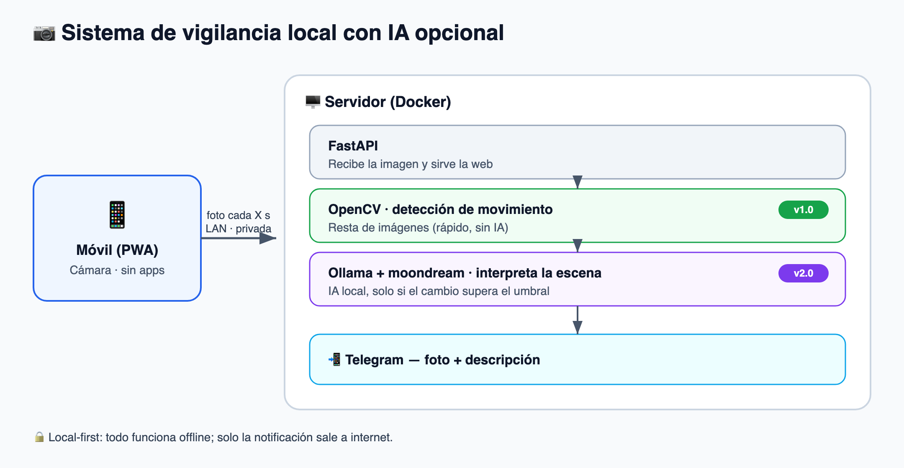
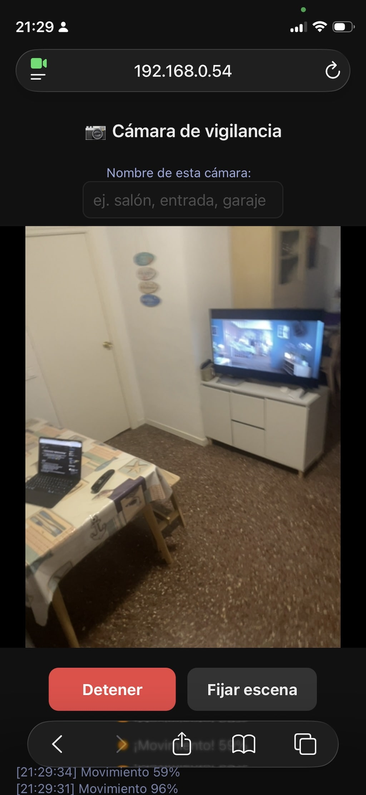

<h1 align="center">📷 Sistema de Alarma · Vigilancia con IA local</h1>

<p align="center">
  Convierte un <b>móvil viejo</b> en una cámara de vigilancia que detecta movimiento
  y, opcionalmente, <b>interpreta la escena con IA local</b> — y te avisa por Telegram.
  <br>
  <b>100% local-first:</b> todo funciona en tu red, sin nube. Tus imágenes no salen de casa.
</p>

<p align="center">
  
  
  
  
</p>

---

## ✨ ¿Qué es?

Un sistema de videovigilancia casero hecho con cosas que ya tienes:

- 📱 Un **móvil antiguo** (iPhone/Android) como cámara — vía web, sin instalar apps.
- 🖥️ Un **ordenador** (Mac/PC, incluso viejo) como cerebro, en Docker.
- 🧠 **IA local opcional** (Ollama) que describe lo que ve la cámara.
- 📲 **Alertas a Telegram** con foto y descripción.

Todo el núcleo (captura, detección de movimiento, IA) funciona **sin internet**.
Solo el envío de la notificación necesita conexión.

> **Dos versiones, mismo código** (cambia un flag):
> - **v1.0** — detección de movimiento + alerta. Corre en cualquier trasto.
> - **v2.0** — añade interpretación de la escena con IA.

---

## 🧩 Cómo funciona

<p align="center">
  
</p>

**Pipeline de dos etapas:** primero un filtro de movimiento barato (OpenCV); la IA
—que es lo costoso— solo se ejecuta cuando el cambio supera un umbral. Así el sistema
está casi siempre ocioso y solo "piensa" cuando pasa algo.

| Parte | Tecnología | ¿IA? |
|---|---|---|
| Servidor web / API | FastAPI + Uvicorn | No |
| Detección de movimiento | OpenCV (visión clásica) | No |
| Imágenes / datos | Pillow + SQLite + disco | No |
| Interpretación de escena | Ollama + `moondream` | **Sí** |
| Notificaciones | Telegram / Email | No |

---

## 🚀 Puesta en marcha

**Requisitos:** [Docker](https://www.docker.com/) y, para la IA, [Ollama](https://ollama.com/)
(se levanta como contenedor incluido).

```bash
git clone https://github.com/ablancodev/sistema-alarma.git
cd sistema-alarma

cp .env.example .env        # edita tus ajustes (ver tabla abajo)
./generate-cert.sh          # detecta IP/host del servidor para el HTTPS

docker compose up --build   # v1.0 (sin IA)
```

Para la **v2.0 con IA**, pon `AI_ENABLED=true` en `.env` y:

```bash
docker compose --profile ai up --build
docker compose exec ollama ollama pull moondream
```

Luego, en el móvil que hará de cámara:

<p align="center">
  
  <br><sub>La interfaz de la cámara funcionando en el móvil.</sub>
</p>

1. Conéctalo a la **misma WiFi** que el servidor.
2. Abre `https://<IP-DEL-SERVIDOR>:8000/` en el navegador (**escribe el `https://` a mano**).
3. (Opcional) ponle un **nombre a la cámara** (Salón, Garaje…).
4. Pulsa **Iniciar**, permite el acceso a la cámara y déjalo enchufado en primer plano.

> #### 🔐 Verás un aviso de "conexión no privada" — y es normal ✅
> El servidor usa un certificado **propio (autofirmado)** dentro de tu red, así que el
> navegador muestra un aviso. Pulsa **"Avanzado" → "Acceder de todos modos"** (en Safari:
> **"Mostrar detalles" → "Visitar este sitio web"**). No es ningún riesgo: es **tu**
> servidor en **tu** red. Ese certificado solo existe porque los navegadores exigen
> HTTPS para poder usar la cámara.
>
> ℹ️ En iOS, mantén la pantalla encendida (la app usa *Wake Lock*) y el navegador en
> primer plano: iOS pausa las webs en segundo plano.

---

## 📲 Alertas por Telegram

1. En Telegram, habla con **@BotFather** → `/newbot` → copia el **token**.
2. Escríbele un mensaje a tu nuevo bot y obtén tu **chat id** con **@userinfobot**.
3. Ponlos en `.env` (`TELEGRAM_BOT_TOKEN`, `TELEGRAM_CHAT_ID`) y reinicia.

(También hay canal de **email** por SMTP; configurable en `NOTIFY_CHANNELS`.)

---

## 🎥 Multi-cámara

Varios móviles pueden vigilar zonas distintas contra el mismo servidor. Cada uno
pone su **nombre** en la web (o `?cam=salon` en la URL) y el servidor mantiene, por
cámara: su referencia, sus eventos y su **cooldown propio**. Las alertas indican la
zona: *"🔔 Movimiento en SALÓN"*.

---

## ⚙️ Configuración (`.env`)

| Variable | Por defecto | Qué hace |
|---|---|---|
| `CAPTURE_INTERVAL_SECONDS` | `3` | Cada cuánto saca foto el móvil |
| `MOTION_MIN_RATIO` | `0.02` | % de cambio para considerar que hay movimiento |
| `AI_ENABLED` | `false` | `true` activa la IA (v2.0) |
| `AI_MIN_RATIO` | `0.05` | % de cambio a partir del cual interpreta la IA |
| `OLLAMA_MODEL` | `moondream` | Modelo de visión de Ollama |
| `NOTIFY_CHANNELS` | `telegram` | `telegram`, `email` o ambos |
| `NOTIFY_COOLDOWN_SECONDS` | `120` | Mínimo entre alertas (anti-spam) |
| `RETENTION_DAYS` | `7` | Días que se guardan las imágenes |

> Importante: en `.env` los comentarios van en su **propia línea** (Docker no
> soporta comentarios en línea en `env_file`).

---

## 🔒 Privacidad

- Las imágenes se procesan y guardan **en tu propio servidor**, nunca en la nube.
- La IA es **local** (Ollama): las fotos no salen de tu red para ser interpretadas.
- Lo único que sale a internet es la **notificación** (Telegram/email).

---

## ⚠️ Limitaciones conocidas

- iOS suspende el JavaScript en segundo plano → usa un móvil **dedicado y enchufado**.
- La IA en CPU (sin GPU) es lenta (~decenas de segundos/imagen); por eso la
  interpretación se procesa en segundo plano y la alerta de movimiento es instantánea.
- La purga de imágenes antiguas se ejecuta al **arrancar** el contenedor.

---

## 🗺️ Roadmap / ideas

- Panel web multi-cámara con histórico.
- Guardar solo el fotograma que dispara la alerta (ahorro de disco).
- Lógica "evento nuevo" (avisar al reaparecer movimiento) en vez de cooldown fijo.
- Canal de aviso 100% local (sonido/panel) para cuando no hay internet.

---

## 📄 Licencia

[MIT](LICENSE) — úsalo, modifícalo y compártelo libremente.

<p align="center"><sub>Hecho reutilizando hardware viejo ♻️ · Contribuciones bienvenidas</sub></p>
